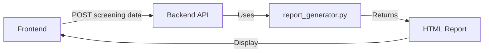

# Sanctions Check 🛡️

Automated SDN/OFAC sanctions screening for compliance professionals.

**Available as:**
- 🌐 Web Application (React)
- 🖥️ Desktop Application (Electron)

## Architecture

- **Frontend**: React (port 3000)
- **Backend**: Python FastAPI (port 8000)
- **Database**: PostgreSQL (port 5432)

## Tech Stack

- React 18
- Python 3.11 + FastAPI
- PostgreSQL 15
- Docker & Docker Compose
- Railway (deployment)

## 🎯 Key Features

### Unified Report Generation
- **Single Source of Truth**: All reports (web, PWA, Electron) generated using `report_generator.py`
- **Consistent Output**: Same HTML structure and styling across all channels
- **Data Validation**: Automatic validation of percentages (0-100% range)
- **Professional Format**: Print-ready reports with metadata, logos, and audit trail

### Multi-Channel Support
- 🌐 **Web Application**: Full-featured browser-based interface
- 📱 **PWA**: Install as a native app on mobile/desktop
- 🖥️ **Electron**: Standalone desktop application for Windows, macOS, Linux

### Screening Capabilities
- Individual screening against OFAC and UN sanctions lists
- Bulk screening via CSV upload
- Real-time matching with confidence scores
- Multi-layer fuzzy matching algorithm

## Quick Start (Local Development)

### Prerequisites

- Docker and Docker Compose installed
- Git

### Run with Docker Compose

```bash
# Clone the repository
git clone https://github.com/develop4God/sanctions-check.git
cd sanctions-check

# Start all services
docker-compose up --build

# Access the application:
# - Frontend: http://localhost:3000
# - Backend API: http://localhost:8000
# - API Docs: http://localhost:8000/api/docs
```

### Stop Services

```bash
docker-compose down

# To also remove volumes (database data):
docker-compose down -v
```

### Detailed Setup Instructions

For detailed localhost setup, environment validation, and troubleshooting, see:
📖 **[LOCALHOST_SETUP.md](LOCALHOST_SETUP.md)**

This guide includes:
- Step-by-step setup without Docker
- Environment validation script
- Testing instructions for all channels (web, PWA, Electron)
- Troubleshooting common issues

## Electron Desktop App 🖥️

The Sanctions Check desktop application provides a native desktop experience with the same functionality as the web app.

### Quick Start - Desktop App

#### Prerequisites
- Node.js 16+ and npm
- For building: Windows, macOS, or Linux development environment

#### Development Mode

```bash
# Navigate to frontend directory
cd frontend

# Install dependencies (first time only)
npm install

# Run in development mode
npm run electron:dev
```

This will:
1. Start the React dev server on http://localhost:3000
2. Launch the Electron app pointing to the dev server
3. Enable hot-reloading for development

#### Building Installers

**Build for your current platform:**
```bash
cd frontend
npm run electron:build
```

**Build for specific platforms:**
```bash
# Windows installer (.exe)
npm run electron:build:win

# macOS installer (.dmg)
npm run electron:build:mac

# Linux installer (.AppImage)
npm run electron:build:linux
```

Output files will be in `frontend/dist/`

#### Build Verification

Run the automated build verification script:
```bash
cd frontend
../scripts/verify-build.sh
```

This script will:
- Clean previous builds
- Build the React app
- Build the Electron installer
- Verify all outputs
- Report the deliverables

### Desktop App Configuration

#### Environment Variables

**Development (.env.development):**
- `REACT_APP_API_URL=http://localhost:8000` - Local backend

**Production (.env.production):**
- `REACT_APP_API_URL=https://your-backend.up.railway.app` - Railway backend

Update `.env.production` with your actual Railway backend URL before building the production installer.

#### App Settings

- **Window Size:** 1400x900 (min: 800x600)
- **Security:** 
  - Context Isolation: Enabled
  - Node Integration: Disabled
  - Preload Script: Enabled
- **Background Color:** #1a1a2e

#### Installer Settings (Windows)

- **Format:** NSIS installer
- **One-Click Install:** Disabled (user can choose directory)
- **Shortcuts:** Desktop and Start Menu
- **Icon:** `frontend/public/icon.png`

### Testing the Desktop App

1. **Test Development Mode:**
   ```bash
   npm run electron:dev
   ```
   - Verify app launches
   - Test API connectivity to local backend
   - Test all features (individual and bulk screening)

2. **Test Production Build:**
   ```bash
   npm run electron:build
   ```
   - Install the generated `.exe` (Windows) or equivalent
   - Verify installer creates shortcuts
   - Launch the app and test all features
   - Verify API calls connect to Railway backend

3. **Manual Testing Checklist:**
   - [ ] App launches without errors
   - [ ] Window can be resized (respects min size)
   - [ ] Individual screening works
   - [ ] Bulk screening (CSV upload) works
   - [ ] Results can be downloaded (CSV, JSON, HTML)
   - [ ] API connection to Railway works
   - [ ] Uninstaller works properly

### Troubleshooting

**"Electron is not recognized"**
- Ensure you're in the `frontend` directory
- Run `npm install` to install dependencies

**"Cannot connect to API"**
- In development: Ensure backend is running on http://localhost:8000
- In production: Update `REACT_APP_API_URL` in `.env.production` with your Railway URL

**Build fails**
- Delete `node_modules` and run `npm install` again
- Ensure you have enough disk space (builds can be 300MB+)
- Check Node.js version (16+ required)

### Architecture - Desktop Mode

```
Electron App (Frontend)
    ↓
Railway API (Backend)
    ↓
PostgreSQL (Database)
```

The desktop app connects to the same Railway backend as the web app, ensuring consistent data and functionality.

## Web Application (Docker)

### Stop Services
## Deploy to Railway

Railway deployment uses a multi-service architecture with separate services for backend, frontend, and database.

### Prerequisites

- [Railway account](https://railway.app)
- GitHub repository connected to Railway

### Step 1: Create Railway Project

1. Go to [Railway Dashboard](https://railway.app/dashboard)
2. Click "New Project" → "Deploy from GitHub repo"
3. Select the `sanctions-check` repository

### Step 2: Add PostgreSQL Database

1. In your Railway project, click "New Service" → "Database" → "PostgreSQL"
2. Railway will automatically create a PostgreSQL instance
3. The `DATABASE_URL` environment variable will be available for other services

### Step 3: Deploy Backend Service

1. Click "New Service" → "GitHub Repo" → Select `sanctions-check`
2. Configure the service:
   - **Name**: `backend`
   - **Root Directory**: `/` (leave empty for root)
   - **Dockerfile Path**: `Dockerfile`

3. Set environment variables in the "Variables" tab:
   ```
   PORT=${{PORT}}
   DATABASE_URL=${{Postgres.DATABASE_URL}}
   CORS_ORIGINS=https://your-frontend.up.railway.app,https://*.up.railway.app
   API_HOST=0.0.0.0
   ```

4. Railway will auto-detect the Dockerfile and deploy

### Step 4: Deploy Frontend Service

1. Click "New Service" → "GitHub Repo" → Select `sanctions-check`
2. Configure the service:
   - **Name**: `frontend`
   - **Root Directory**: `frontend`
   - **Dockerfile Path**: `frontend/Dockerfile`

3. Set build arguments in "Variables" tab:
   ```
   REACT_APP_API_URL=https://your-backend.up.railway.app
   ```

4. After backend deploys, update `REACT_APP_API_URL` with the actual backend URL

### Step 5: Configure Networking

1. For each service, go to "Settings" → "Networking"
2. Click "Generate Domain" to create a public URL
3. Update the frontend's `REACT_APP_API_URL` with the backend's domain
4. Update the backend's `CORS_ORIGINS` with the frontend's domain

### Railway Environment Variables Reference

#### Backend Service

| Variable | Description | Example |
|----------|-------------|---------|
| `PORT` | Auto-provided by Railway | `${{PORT}}` |
| `DATABASE_URL` | PostgreSQL connection string | `${{Postgres.DATABASE_URL}}` |
| `CORS_ORIGINS` | Allowed frontend origins | `https://frontend.up.railway.app` |
| `API_HOST` | API bind address | `0.0.0.0` |
| `API_KEY` | Optional API authentication | `your-secure-key` |

#### Frontend Service

| Variable | Description | Example |
|----------|-------------|---------|
| `REACT_APP_API_URL` | Backend API URL (build arg) | `https://backend.up.railway.app` |

### CORS Configuration for Railway

The backend supports wildcard CORS patterns for Railway's dynamic subdomains:

```bash
# Allow specific Railway subdomain
CORS_ORIGINS=https://sanctions-check-frontend.up.railway.app

# Allow all Railway subdomains (development)
CORS_ORIGINS=https://*.up.railway.app

# Multiple origins
CORS_ORIGINS=https://frontend.up.railway.app,https://*.up.railway.app,http://localhost:3000
```

### Troubleshooting

1. **CORS errors**: Ensure `CORS_ORIGINS` includes your frontend's Railway URL
2. **Database connection**: Verify `DATABASE_URL` is linked from PostgreSQL service
3. **Port issues**: Railway provides `PORT` automatically - don't hardcode 8000
4. **Build failures**: Check that root directory and Dockerfile path are correct

### Local Development with Railway

You can use the `.env.railway.example` files as reference:
- Root: `.env.railway.example` - Backend configuration
- Frontend: `frontend/.env.railway.example` - Frontend configuration

## Environment Variables

### Backend (Required)

| Variable | Description | Default |
|----------|-------------|---------|
| `DB_HOST` | PostgreSQL host | `localhost` |
| `DB_PORT` | PostgreSQL port | `5432` |
| `DB_NAME` | Database name | `sdn_database` |
| `DB_USER` | Database user | `sdn_user` |
| `DB_PASSWORD` | Database password | `sdn_password` |
| `API_HOST` | API bind host | `0.0.0.0` |
| `API_PORT` | API port | `8000` |
| `CORS_ORIGINS` | Allowed CORS origins | `http://localhost:3000` |

### Backend (Optional)

| Variable | Description | Default |
|----------|-------------|---------|
| `API_KEY` | API key for protected endpoints | (disabled) |
| `DATA_DIR` | Sanctions data directory | `sanctions_data` |
| `CONFIG_PATH` | Config file path | `config.yaml` |

### Frontend

| Variable | Description | Default |
|----------|-------------|---------|
| `REACT_APP_API_URL` | Backend API URL | `http://localhost:8000` |

## API Endpoints

### Screening
- `GET /api/v1/health` - Health check and service status
- `POST /api/v1/screen` - Screen individual against sanctions lists
- `POST /api/v1/screen/bulk` - Bulk screening (CSV upload)
- `POST /api/v1/data/update` - Update sanctions data

### Report Generation (NEW) ✨
- `POST /api/v1/reports/generate` - Generate individual screening report
  - Uses backend's `report_generator.py` for consistent output
  - Returns HTML content ready for display/print
  - Ensures correct percentage display (0-100%)
  
- `POST /api/v1/reports/generate-bulk` - Generate bulk screening report
  - Consolidates multiple results into single report
  - Includes statistics and detailed table
  - Same styling as individual reports

### Documentation
- `GET /api/docs` - Interactive Swagger documentation
- `GET /api/redoc` - ReDoc API documentation

### Debug & Monitoring
- `GET /api/v1/debug/connection-logs` - View connection logs
- `GET /api/v1/debug/data-mode` - Check data mode (XML/Database)

## Report Generation Architecture

All reports are now generated using the backend's `report_generator.py` module, ensuring:

1. **Consistency**: Same HTML structure across web, PWA, and Electron
2. **Correctness**: Validated percentage calculations (fixes 825% bug)
3. **Maintainability**: Single source of truth for report templates
4. **Features**: Includes metadata, audit trail, and professional styling

### How It Works



The frontend no longer generates HTML - it calls the backend API which uses the same report generator regardless of channel.

## Embedding Logo in HTML Reports

The audit log HTML report includes a logo at the top, embedded as a base64 PNG image. To update:

1. Replace the base64 string in `python/logo_base64.txt` with your own PNG logo
2. The logo will appear automatically in all generated HTML reports

## License

Proprietary - Sanctions Check © 2025

---

Sanctions Check - Professional SDN screening 🚀
